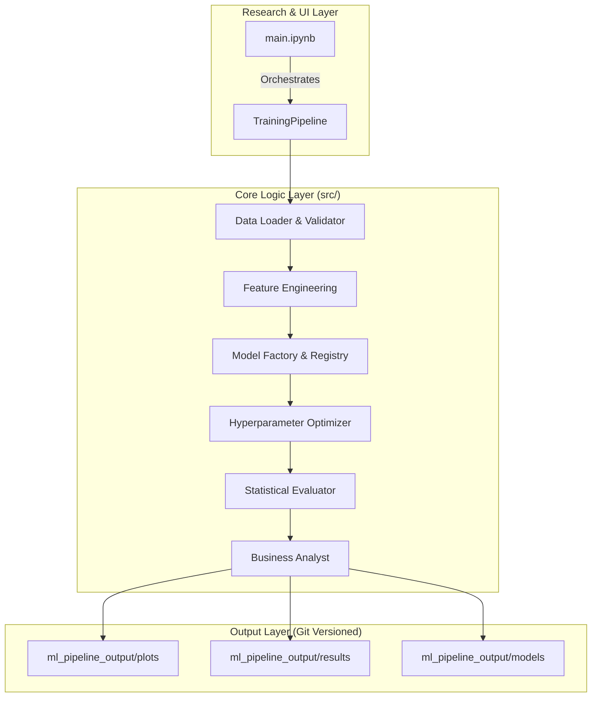

# 📊 Pro-Level Credit Approval ML Pipeline (Enterprise V3.5)


## 🎯 Overview

The **Enterprise Credit Approval ML Pipeline** is a state-of-the-art hybrid framework designed for rigorous financial risk assessment. It bridges the gap between **interactive exploratory research** (via Google Colab) and **modular production deployment** (via a clean Python architecture). 

This system doesn't just predict defaults; it provides a full **Business Case Analysis**, calculating the financial feasibility of model deployment through ROI, NPV, and operational efficiency metrics.

---

## 🌟 Key Features

### 🤖 Mathematical & Model Excellence
- **Multi-Algorithm Training**: Integrated support for XGBoost, LightGBM, CatBoost, RandomForest, GradientBoosting, and LogisticRegression.
- **Optuna Optimization**: Automated hyperparameter tuning with stratified cross-validation.
- **GPU Acceleration**: Built-in CUDA support for extreme training speeds on large datasets.

### 🔬 Statistical Validation (The "Enterprise" Difference)
- **Friedman Test**: Rigorous non-parametric testing to ensure model differences are statistically significant.
- **Bonferroni Correction**: Post-hoc pairwise analysis to eliminate false discoveries in model selection.

### 💼 Portfolio Strategy & Business Impact
- **Financial Modeling**: Automated calculation of **ROI (Return on Investment)** and **NPV (Net Present Value)** over 5 years.
- **Amortization & Payback**: Real-time tracking of when the ML system "pays for itself."
- **Sensitivity Analysis**: Scenarios for Optimistic, Realistic, and Pessimistic market conditions.
- **Operational Efficiency**: Visualization of decision time reduction (3.2h vs 0.1h).

### 📈 Comprehensive Visualization (20+ Dashboards)
- **12-Panel Business Impact Dashboard**: A panoramic view of risk vs reward.
- **6-Panel Selection Dashboard**: Visualizing the trade-offs between technical accuracy and deployment stability.

---

## 🏗️ Architecture: Hybrid Pro Structure

The project follows a **Modified Monolithic-Modular** pattern, optimized for Data Science workflows.



---

## 📂 Project Directory Structure

```text
credit-approval/
├── 📁 src/                      # Modüler Üretim Kodları (Paket Yapısı)
│   ├── 📁 core/                 # Konfigürasyon ve Logger Yönetimi
│   ├── 📁 data/                 # Veri Yükleme ve Kalite Kontrol (Validator)
│   ├── 📁 features/             # Öznitelik Mühendisliği ve Preprocessing
│   ├── 📁 models/               # Model Fabrikası ve Versiyonlanmış Kayıt (Registry)
│   ├── 📁 training/             # Trainer ve Optuna Optimizasyon Katmanı
│   ├── 📁 evaluation/           # [Enterprise] İstatistiksel Testler ve Finansal Analiz
│   └── 📁 pipelines/            # Ana Pipeline Orkestrasyonu
├── 📁 ml_pipeline_output/       # Pipeline Çıktıları (Versioned)
│   ├── 📁 models/               # .joblib formatında eğitilmiş modeller
│   ├── 📁 plots/                # Dashboard'lar ve Analiz Grafikleri (20+ PNG)
│   ├── 📁 results/              # İş vakası (Business Case) ve Metrik Raporları (JSON/TXT)
│   └── 📁 logs/                 # Detaylı çalışma logları
├── main.ipynb                   # İnteraktif Colab/Jupyter Arayüzü
├── main.py                      # CLI (Komut Satırı) Arayüzü
├── requirements.txt             # Bağımlılık Listesi
└── README.md                    # Bu Kılavuz
```

---

## 🔬 Statistical Validation Modules

The pipeline implements rigorous statistical testing to compare model performance, ensuring that the selection of the "Best Model" is mathematically sound rather than just a result of random variance across folds.

### Key Features
- **Friedman Test Implementation**: Non-parametric comparison of multiple models across CV folds.
- **Multiple Comparison Correction**: Bonferroni adjustment for family-wise error rate protection.
- **Confidence Intervals**: Statistical uncertainty quantification for all metrics.

---

## 💼 Business Impact Analysis

Unlike standard ML pipelines, this system translates technical metrics into board-room ready financial reports.

### Financial Metrics
- **ROI Calculation**: Net profit divided by implementation costs.
- **NPV (5 Year)**: 5-year Net Present Value with a 10% discount rate.
- **Payback Period**: Identifying exactly how many months until initial investment recovery.
- **Strategic Roadmap**: Automated generation of a 4-phase deployment plan.

---

## 📊 Pipeline Stages

| Stage | Logic (src/) | Summary |
|:--- |:--- |:--- |
| **Stage 1: Setup** | `core/` | Environment setup, GPU detection, and logging init. |
| **Stage 2: Data** | `data/` | Data ingestion with 10+ quality validation checks. |
| **Stage 3: Features** | `features/` | Advanced feature creation (Income Ratios, Age/Employment). |
| **Stage 4: Training** | `training/` | Multi-algorithm training with Optuna HPO enabled. |
| **Stage 5: Stats** | `evaluation/` | Statistical significance testing (Friedman + Post-hoc). |
| **Stage 6: Selection** | `evaluation/` | Multi-criteria selection & Interpretability analysis. |
| **Stage 7: Business** | `evaluation/` | Enterprise reporting & ROI dashboard generation. |

---

### Phase 1: Environment Setup & Configuration
Professional environment setup with dependency management, logging configuration, and GPU detection.
- Comprehensive dependency checking
- Professional logging system
- GPU acceleration detection
- Configuration validation

### Phase 2: Data Loading & Validation
Robust data loading with comprehensive validation, quality checks, and temporal integrity verification.
- Multi-path data loading with fallbacks
- Comprehensive data quality validation
- Temporal data splitting for leakage prevention
- Detailed validation reporting

### Phase 3: Data Preprocessing & Feature Engineering
Safe preprocessing pipeline with advanced feature engineering, proper fit-transform patterns, and leakage prevention.
- Safe train/validation/test splitting
- Advanced feature engineering (age groups, income ratios, employment categories)
- Categorical encoding with unseen category handling
- Outlier detection and treatment

### Phase 4: Model Training & Hyperparameter Optimization
Multi-algorithm training with Optuna optimization, GPU acceleration, and comprehensive evaluation.
- 6 different algorithms with GPU support
- Optuna hyperparameter optimization
- Cross-validation with stratification
- Performance tracking and comparison

### Phase 5: Model Evaluation & Statistical Comparison
Comprehensive model evaluation with statistical validation, Friedman tests, and business impact assessment.
- Statistical significance testing (Friedman + post-hoc)
- Business impact analysis
- Comprehensive visualizations
- Detailed comparison reports

### Phase 6: Model Selection & Final Validation
Multi-criteria model selection with deployment readiness assessment and interpretability analysis.
- Multi-criteria decision making
- Deployment readiness assessment
- Model interpretability analysis
- Final validation and recommendations

### Phase 7: Business Impact Analysis & Insights
Enterprise-grade business analysis with ROI calculations, stakeholder reports, and implementation roadmaps.
- Comprehensive financial analysis (ROI, NPV, payback)
- Risk assessment and mitigation strategies
- Stakeholder-specific reports
- Implementation roadmap and success metrics

---

## 👥 Target Audience

| Audience | Use Case |
|----------|----------|
| 🏦 **Banking & FinTech** | Optimize credit approval workflows |
| 📊 **Risk & Compliance** | Reduce default risk via robust ML validation |
| 💼 **Executives** | Business impact reports with ROI & roadmap |
| 👩‍💻 **Data Scientists** | End-to-end ML pipeline ready for deployment |

---

## 🔧 Advanced Usage

### Custom Model Integration
You can easily add new models to the framework by extending the `ModelFactory`:
```python
# src/models/factory.py içinde CustomModelFactory oluşturun
```

### Custom Business Metrics
To add industry-specific financial metrics, modify the `BusinessImpactAnalyst` class in `src/evaluation/business.py`.

---

## 🚀 Quick Start

### Local Environment
```bash
pip install -r requirements.txt
python main.py
```

### Google Colab
1. Upload folder to Drive.
2. Open `main.ipynb`.
3. Set `PROJECT_PATH` in the first cell.
4. Run all cells sequentially.

---
*Developed for Pro-Grade Credit Risk Management - Hybrid V3.5 Framework*
