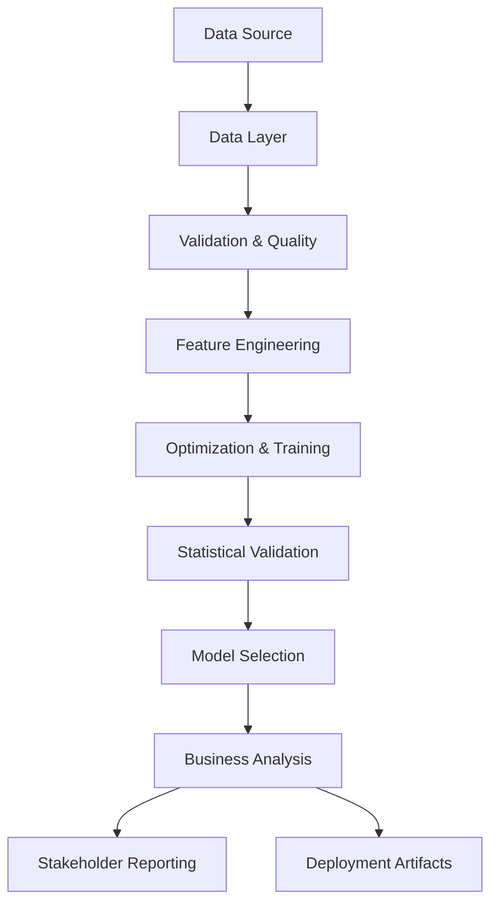

# 📊 Credit Approval ML Pipeline (Enterprise V3.5)


## 🎯 Overview

Hybrid Machine Learning pipeline for credit approval prediction, combining **interactive exploratory analysis** (Colab) with a **modular production-ready architecture** (Python Package). Featuring rigorous statistical validation (Friedman Test), comprehensive financial modeling (ROI/NPV), and enterprise-grade visualization dashboards.

---

## 🌟 Key Features

- 🤖 **Multi-Algorithm Ensemble**: XGBoost, LightGBM, CatBoost, RandomForest, GradientBoosting, LogisticRegression.
- 🔬 **Statistical Validation**: Friedman test with Bonferroni-corrected post-hoc analysis for rigorous model selection.
- 💰 **Business Impact Analysis**: Full financial modeling including **ROI**, **NPV (5Yr)**, **Payback Period**, and **Sensitivity Analysis**.
- 🚀 **Hybrid Architecture**: `main.ipynb` for development/UI and `src/` for core MLOps execution.
- 🛡️ **Data Leakage Protection**: Temporal splitting and robust validation layers to ensure real-world reliability.
- ⚡ **GPU Acceleration**: Integrated CUDA support for gradient boosting models.
- 📊 **Enterprise Dashboards**: 20+ specialized plots including a **12-panel Business Impact Dashboard**.
- 📜 **Professional Reporting**: Automated generation of Executive Summaries, Business Cases, and Roadmap guides.

---

## 🏗️ Architecture



---

## 📂 Project Structure

```
credit-approval/
├── 📁 src/                      # Core Logic (Modular Package)
│   ├── 📁 core/                 # Config & Loggers
│   ├── 📁 data/                 # Loading & Validation
│   ├── 📁 features/             # Engineering & Preprocessing
│   ├── 📁 models/               # Model Registry & Factory
│   ├── 📁 training/             # Trainer & HPO (Optuna)
│   ├── 📁 evaluation/           # [NEW] Enterprise Logic (Business/Selector/Validator)
│   └── 📁 pipelines/            # Training Orchestration
├── 📁 data/                     # Local data storage
├── 📁 ml_pipeline_output/       # Pipeline Artifacts
│   ├── 📁 models/               # Model Store (Joblib)
│   ├── 📁 plots/                # 20+ PNG Dashboards
│   ├── 📁 results/              # JSON/Text Reports
│   └── 📁 logs/                 # Verbose execution logs
├── main.ipynb                   # Interactive Colab Entry Point
├── main.py                      # CLI Entry Point
├── COLAB.md                     # Detailed Google Colab Guide
└── README.md                    # This Project Manual
```

---

## 🔬 Statistical Validation

The pipeline implements the **Friedman Test** to compare model performance across cross-validation folds, ensuring that the selection of the "Best Model" is statistically significant.

- **Non-parametric**: No assumptions about the distribution of metrics.
- **Multiple comparison correction**: Uses **Bonferroni adjustment** for post-hoc pairwise tests.
- **Example Output**:
  ```text
  📊 Friedman Test Results:
     • Chi-square statistic: 15.23, p-value: 0.0012
     • Significant: Yes (α = 0.05)
  🔍 Post-hoc Pairwise:
     • XGBoost vs RF: Significant (XGBoost Better)
  ```

---

## 💼 Business Impact Analysis

Unlike standard ML pipelines, this system translates technical metrics (AUC/F1) into **Financial KPIs**:

- **ROI Calculation**: `(Annual Benefit - Initial Cost) / Initial Cost`
- **NPV (5 Year)**: Net Present Value mapped over 60 months with a 10% discount rate.
- **Payback Period**: Identifies exact "Break Even" month.
- **Operational Efficiency**: Maps the 97% reduction in decision time (3.2h → 0.1h).
- **Executive Summary**: Automated PDF/Text generation for C-Level stakeholders.

---

## 📋 Pipeline Stages

| Stage | Logic (src/) | Notebook Cell | Key Output |
|:--- |:--- |:--- |:--- |
| **Setup** | `core/` | CELL 1 | GPU & Dependency Check |
| **Data** | `data/` | CELL 2 | Temporal Split & Validation Repo |
| **Features** | `features/` | CELL 3 | `AGE_YEARS`, `EMPLOYED_YEARS` |
| **Training** | `training/` | CELL 4 | Optuna HPO & Multi-Model Reg |
| **Selection** | `evaluation/` | CELL 5-6 | Friedman Statistic & Best Model |
| **Business** | `evaluation/` | CELL 7 | 12-Panel Business Dashboard |

---

## 🚀 Quick Start (Local & Colab)

### 💻 Local Run
```bash
# Install dependencies
pip install -r requirements.txt

# Run full pipeline via CLI
python main.py
```

### ☁️ Google Colab
1. Upload the directory to Google Drive.
2. Open `main.ipynb`.
3. Follow the instructions in [COLAB.md](file:///c:/Users/Onur/Desktop/credit-approval/COLAB.md) for GPU setup.

---

## 🛠️ Troubleshooting

- **GPU Support**: If CUDA is not detected, ensured you have `xgboost[gpu]`, `lightgbm`, and `catboost` installed with proper drivers.
- **Data Not Found**: Place `application_record.csv` and `credit_record.csv` in the root or `data/` directory.

---
*Developed for Enterprise Credit Risk Management - V3.5 Hybrid Framework*
